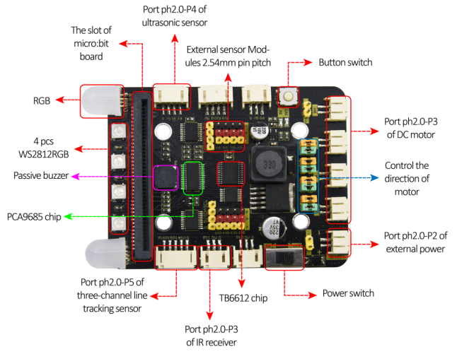
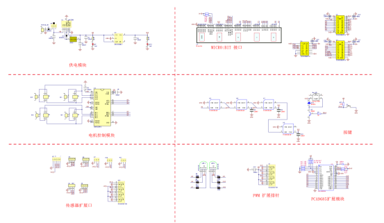
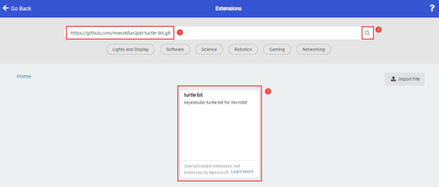

# KS4018 Micro:bit

## 1. Description

The Micro:bit motor drive expansion board contains a PCA9685PW chip and a TB6612FNG chip and so on. In order to save IO port resources, we use some pins of PCA9685PW chip to control the TB6612FNG motor chip. 

The TB6612FNG motor chip is used to control the rotation direction and speed of two DC gear motors. It also integrates 2 RGB lights, 4 WS2812RGB lights, a buzzer with a P2.0 ultrasonic interface, a P2.0 IR sensor interface and a P2.0 tracking sensor interface. The output voltages of TXS0108EPWR level conversion IC interface is 5V.

## 2. Parameters

- Input voltage: DC7-12V
- Output voltage: 5V
- Length, width and height: 92*64*15mm
- Weight (bare board): 41.8g

## 3. Wiring Up

## 4. Connection Diagram

## 5. Add a library

Right-click Extensions

Click and click the library file. 

